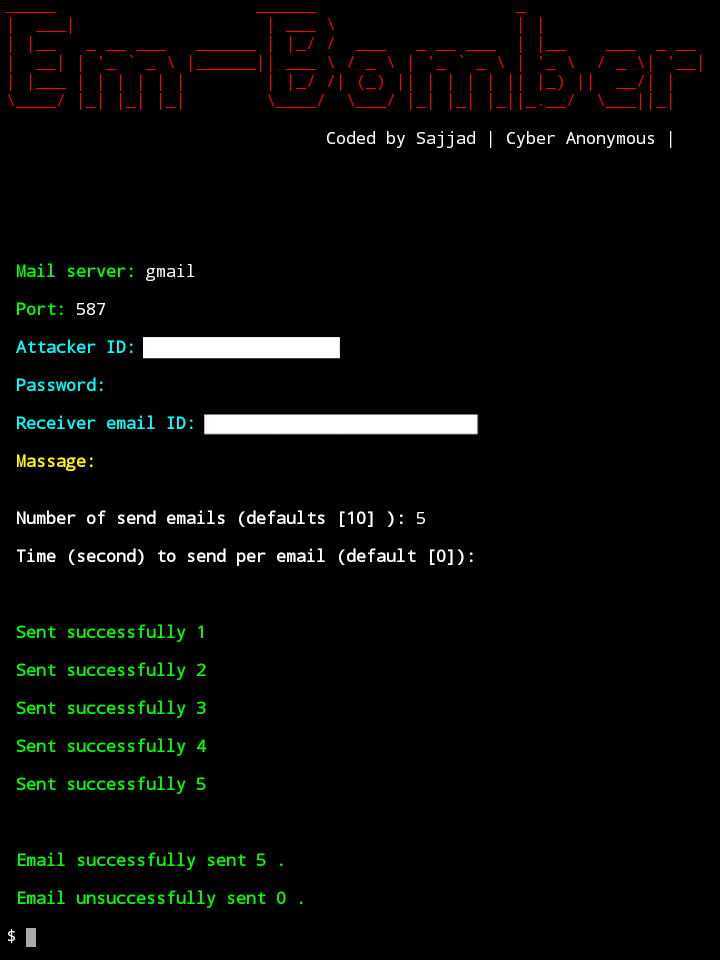

<h1 Align="Center">Em-Bomber v1.0</h1>


### About Em-Bomber
Em-Bomber is for send multiple emails at a time.

### Screenshot


### Em-Bomber is available for
* Termux

### Installation
```
$apt-get update -y
```
```
$apt-get upgrade -y
```
```
$pkg install python -y
```
```
$pkg install python3 -y
```
```
$pkg install git -y
```
```
$git clone https://www.github.com/Cyber-Anonymous/Em-Bomber
```
```
$ls
```
```
$cd Em-Bomber
```
```
$ls
```
```
$python3 em-bomber.py
```
* Now you need internet connection.
* You need to enable less secure app.

### Warning
**Em-Bomber is for only educational purpose. Don't use it any illegal. We are not responsible for any illegal activities.**
