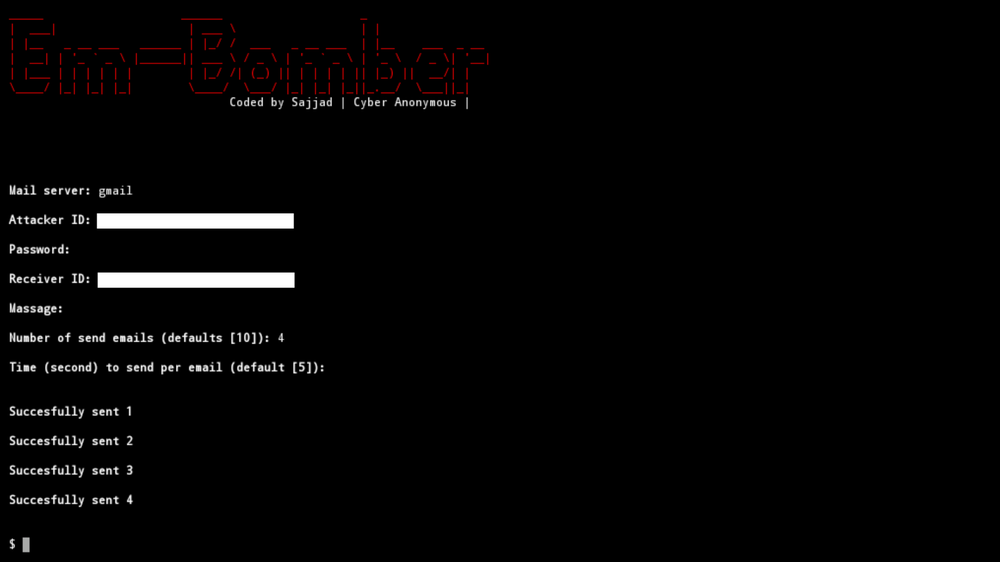

# Em-Bomber v1.1
Bomb emails

# Tested on
- Termux

# Installation
* apt-get update -y

* apt-get upgrade -y

* pkg install python -y

* pkg install python3 -y

* pip install requests

* pkg install git -y

* git clone https://github.com/Cyber-Anonymous/Em-Bomber

* cd Em-Bomber

* python3 em-bomber.py

`Enable Less Secure Apps.`

# Em-Bomber

# Warning
***This tool is only for educational purpose. We are not responsible for any misuse or illegal activities.***
